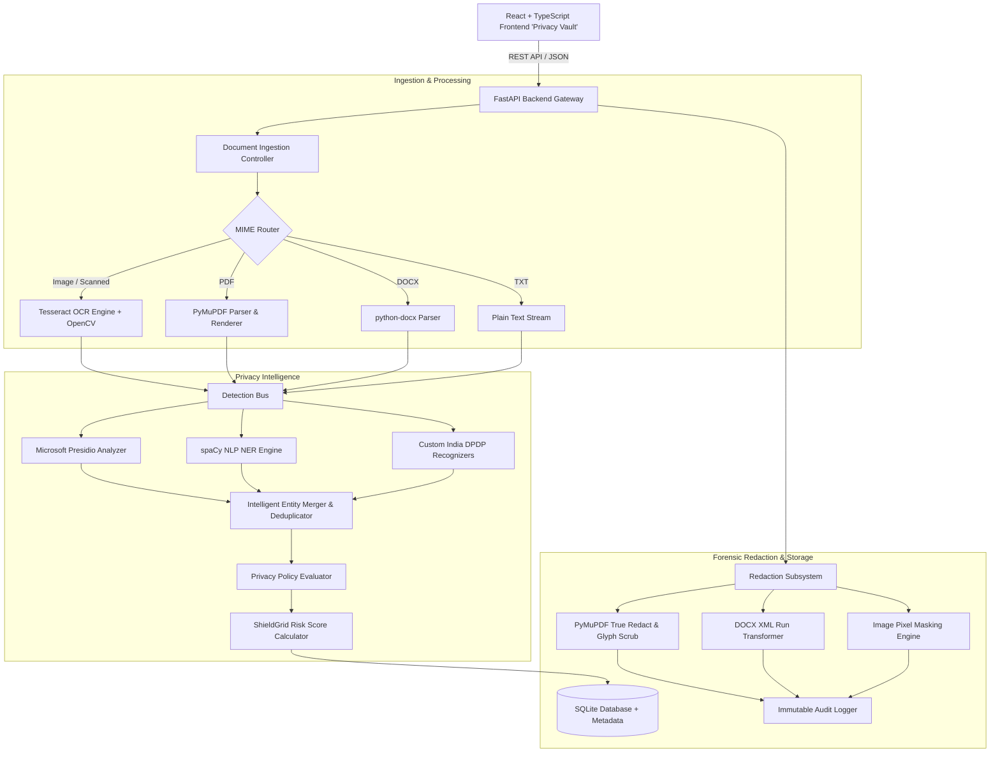
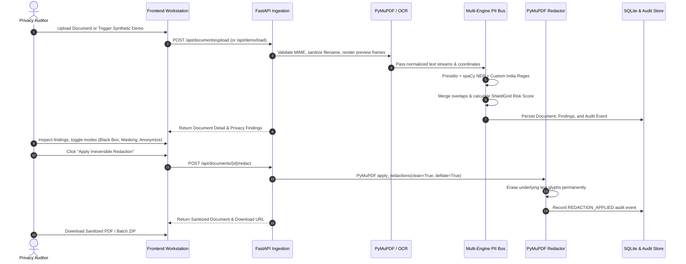
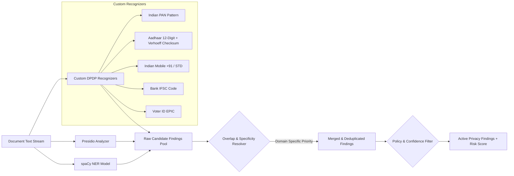

# ShieldGrid 2.0

> **Enterprise Privacy Intelligence & Forensic Document Redaction Platform**  
> Autonomous multi-engine PII detection, India DPDP Act statutory recognition, explainable confidence scoring, and true irreversible cryptographic redaction.

[](LICENSE)
[](https://www.python.org/)
[](https://fastapi.tiangolo.com/)
[](https://react.dev/)
[](https://tailwindcss.com/)
[](https://pymupdf.readthedocs.io/)
[](https://github.com/tesseract-ocr/tesseract)

---

## 1. Overview

**ShieldGrid 2.0** is an enterprise-grade document privacy intelligence workstation designed for security operations centers (SOC), compliance auditors, and privacy engineers. It combines Microsoft Presidio, spaCy NLP Named Entity Recognition, custom statutory pattern recognizers (including India DPDP Act compliance for PAN, Aadhaar with Verhoeff checksum, Indian phone numbers, and IFSC), Tesseract OCR with adaptive image preprocessing, and true irreversible PyMuPDF PDF font-stream scrubbing.

Unlike toy PII detectors that merely draw visual black CSS overlays on web viewers, ShieldGrid 2.0 applies **permanent, irreversible redactions directly to underlying document content streams**, completely scrubbing character glyphs and metadata so sensitive information cannot be recovered via text selection, copy-pasting, or forensic string extraction.

---

## 2. Problem Statement

Enterprises and government institutions share millions of PDFs, invoices, scanned IDs, and employee records daily. Conventional redaction workflows suffer from critical security failures:
1. **Visual-Only Redaction Flaws**: Organizations frequently draw black rectangular annotations over sensitive text in standard PDF viewers (Acrobat, Preview), leaving the underlying searchable text bytes intact and trivially extractable by copy-pasting or running `pdftotext`.
2. **Generic PII Blindspots**: Traditional NLP models miss country-specific statutory identifiers such as Indian Permanent Account Numbers (PAN), 12-digit Aadhaar identity cards, and IFSC banking codes.
3. **Black-Box AI Models**: Modern compliance frameworks (India DPDP Act 2023, EU GDPR, HIPAA, PCI-DSS) require **explainable risk auditing** detailing *why* an entity was classified, *which detector engine* recognized it, and *what confidence score* was calculated.

---

## 3. Solution

ShieldGrid 2.0 delivers an integrated forensic privacy workspace:
- **True Irreversible Redaction**: Leverages PyMuPDF `apply_redactions(images=fitz.PDF_REDACT_IMAGE_PIXELS)` to permanently expunge character glyphs, deflating and cleaning underlying PDF XRef streams.
- **Multi-Engine Intelligence**: Orchestrates Microsoft Presidio Analyzer, spaCy statistical NER (`en_core_web_sm`), custom India statutory pattern detectors, and Tesseract 5.5 OCR.
- **Explainable ShieldGrid Risk Score**: Calculates an application-defined heuristic (0–100) factoring in statutory weightings, density per page, and regulatory sensitivity.
- **Forensic Workstation UX**: A custom 3-column "Privacy Vault" dark interface with interactive page thumbnails, canvas highlights, granular entity filtering, and 5 transformation modes.

---

## 4. Key Features

- **Document Format Ingestion**: Native parsing for PDF (searchable & scanned), DOCX (paragraphs & tables), Images (PNG, JPG, JPEG via OCR), and Plain Text (TXT).
- **Tesseract OCR Pipeline**: Automatic scanned document detection, Otsu adaptive binarization, noise filtering, and word-level coordinate extraction.
- **India Statutory Identifiers**: Custom pattern recognizers for:
  - **PAN Card**: Pattern `[A-Z]{5}[0-9]{4}[A-Z]{1}` with entity-type validation.
  - **Aadhaar Identity**: 12-digit detection with dihedral group $D_5$ **Verhoeff algorithm checksum validation**.
  - **Indian Phone Numbers**: `+91` mobile prefixes and 10-digit formats starting with 6, 7, 8, 9.
  - **Bank IFSC Code**: Reserve Bank of India 11-character format (`[A-Z]{4}0[A-Z0-9]{6}`).
  - **Voter ID (EPIC)**: 3 letters followed by 7 digits.
- **5 Redaction Modes**:
  1. **Black Box**: Permanent solid fill (`████████` / PDF black box).
  2. **Masking**: Preserves structural boundary hints (`j***@example.com`, `XXXX-XXXX-1234`).
  3. **Pseudonymization / Anonymization**: Consistent document-level tokens (`PERSON_001`, `EMAIL_002`).
  4. **Cryptographic Hashing**: Deterministic SHA-256 digest preview (`SHA256: 8f4b...`).
  5. **Replacement**: Categorical tags (`[REDACTED PERSON]`) or custom labels.
- **Explainable Finding Cards**: Details What, Where (Page & offset), Why (rule name & pattern), Confidence (%), and Detector Source.
- **Batch Processing Queue**: Multi-file ingestion with automated risk labeling and consolidated ZIP export.
- **Tamper-Evident Audit Trail**: Structured event logging (ingestion, inspection, redaction, export, purge) with strict raw-PII non-leakage.
- **1-Click Synthetic Demos**: Zero-friction testing with pre-packaged synthetic Indian KYC records, medical hospital statements, executive resumes, and scanned citizen IDs.

---

## 5. System Architecture



---

## 6. Document Processing Pipeline



---

## 7. PII Detection Pipeline



---

## 8. Redaction Architecture

ShieldGrid 2.0 enforces true irreversibility:

| Document Type | Redaction Mechanism | Verification Standard |
| :--- | :--- | :--- |
| **PDF (Digital)** | PyMuPDF `add_redact_annot()` + `apply_redactions(images=fitz.PDF_REDACT_IMAGE_PIXELS, clean=True)` | Underlying text character glyphs are deleted from the PDF stream; `page.get_text()` returns zero hits for sensitive strings. |
| **PDF (Scanned)** | Pixel-level solid fills over OCR coordinates + page raster replacement | Visual and OCR text permanently removed from raster layer. |
| **DOCX** | Document paragraph and table XML run text replacement | Text strings replaced at run level; file rewritten without sensitive metadata. |
| **Plain Text** | UTF-8 in-memory string scrubbing | Substrings replaced with mode representations. |
| **Images** | Pillow / OpenCV opaque rectangle fill | Pixel data overwritten irreversibly. |

---

## 9. Tech Stack

### Backend
- **Python**: 3.12+
- **FastAPI**: Asynchronous high-performance REST API
- **Microsoft Presidio**: `presidio-analyzer` & `presidio-anonymizer`
- **spaCy**: Statistical Named Entity Recognition (`en_core_web_sm`)
- **PyMuPDF (`fitz`)**: Low-level PDF rendering, coordinate extraction, and true redaction
- **Tesseract OCR**: v5.5.3 with OpenCV preprocessing
- **python-docx**: DOCX parsing and manipulation
- **Pillow & OpenCV**: Image thresholding, binarization, and coordinate masking
- **SQLAlchemy & SQLite**: ACID-compliant local metadata and audit persistence
- **pytest**: Automated unit and integration test suite

### Frontend
- **React**: 19 with TypeScript
- **Vite**: Ultra-fast build tool and development server
- **Tailwind CSS**: Custom "Privacy Vault" cybersecurity color system
- **Lucide React**: Clean iconography
- **Recharts**: Responsive telemetry data visualizations

---

## 10. Project Structure

```
ShieldGrid-2.0/
├── backend/
│   ├── app/
│   │   ├── anonymization/        # 5 Redaction mode transformers
│   │   │   └── transformer.py
│   │   ├── api/                  # FastAPI routers
│   │   │   ├── analytics.py
│   │   │   ├── audit.py
│   │   │   ├── demo.py
│   │   │   ├── documents.py
│   │   │   ├── findings.py
│   │   │   └── policies.py
│   │   ├── core/                 # Config & security utilities
│   │   │   ├── config.py
│   │   │   └── security.py
│   │   ├── database/             # SQLAlchemy engine & session
│   │   │   └── session.py
│   │   ├── detectors/            # Detection engines & merger
│   │   │   ├── custom_recognizers.py # India PAN, Aadhaar (Verhoeff), IFSC
│   │   │   ├── merger.py
│   │   │   ├── presidio_engine.py
│   │   │   └── spacy_engine.py
│   │   ├── documents/            # Parsers & true redactors
│   │   │   ├── docx_parser.py
│   │   │   ├── image_parser.py
│   │   │   ├── pdf_parser.py
│   │   │   ├── pdf_redactor.py   # True PyMuPDF font-stream scrubbing
│   │   │   └── text_parser.py
│   │   ├── models/               # SQLAlchemy ORM models
│   │   │   └── models.py
│   │   ├── ocr/                  # Tesseract OCR engine + OpenCV
│   │   │   └── tesseract_engine.py
│   │   ├── schemas/              # Pydantic request/response schemas
│   │   │   └── schemas.py
│   │   └── services/             # Core business logic
│   │       ├── analytics_service.py
│   │       ├── audit_service.py
│   │       ├── document_service.py
│   │       ├── policy_service.py
│   │       └── risk_engine.py
│   ├── demo_data/                # Synthetic test documents
│   │   ├── generate_demos.py
│   │   ├── synthetic_access_log.txt
│   │   ├── synthetic_executive_resume.pdf
│   │   ├── synthetic_kyc_record.pdf
│   │   ├── synthetic_medical_invoice.pdf
│   │   └── synthetic_scanned_id.png
│   ├── tests/                    # pytest suite
│   │   ├── test_api.py
│   │   ├── test_detectors.py
│   │   └── test_redaction.py     # Verifies irreversible text deletion
│   ├── main.py                   # Application entrypoint
│   └── requirements.txt
├── frontend/
│   ├── src/
│   │   ├── components/           # UI components
│   │   │   ├── DocumentViewer.tsx
│   │   │   ├── EntityBadge.tsx
│   │   │   ├── FindingsPanel.tsx
│   │   │   ├── Header.tsx
│   │   │   ├── RiskIndicator.tsx
│   │   │   └── Sidebar.tsx
│   │   ├── pages/                # 8 Application modules
│   │   │   ├── Analytics.tsx
│   │   │   ├── AuditLog.tsx
│   │   │   ├── BatchProcessing.tsx
│   │   │   ├── Dashboard.tsx
│   │   │   ├── DocumentReview.tsx
│   │   │   ├── DocumentScanner.tsx
│   │   │   ├── PrivacyPolicies.tsx
│   │   │   └── Settings.tsx
│   │   ├── services/
│   │   │   └── api.ts
│   │   ├── types/
│   │   │   └── index.ts
│   │   ├── App.tsx
│   │   ├── index.css
│   │   └── main.tsx
│   ├── package.json
│   ├── tailwind.config.js
│   └── vite.config.ts
├── Dockerfile
├── docker-compose.yml
├── .env.example
├── .gitignore
└── README.md
```

---

## 11. Installation

### Prerequisites
- Python 3.11 or 3.12
- Node.js 18+ and npm
- Tesseract OCR (v5.0+)

### System OCR Setup
- **macOS**:
  ```bash
  brew install tesseract
  ```
- **Ubuntu / Debian**:
  ```bash
  sudo apt-get update && sudo apt-get install -y tesseract-ocr tesseract-ocr-eng
  ```

---

## 12. Running Locally

### 1. Backend Setup
```bash
# Navigate to project root
cd "ShieldGrid 2.0"

# Create and activate Python virtual environment
python3.12 -m venv backend/venv
source backend/venv/bin/activate

# Install dependencies and spaCy language model
pip install -r backend/requirements.txt
python -m spacy download en_core_web_sm

# Generate synthetic demo documents
python backend/demo_data/generate_demos.py

# Start FastAPI backend server
PYTHONPATH=backend python -m uvicorn main:app --host 127.0.0.1 --port 8000 --reload
```

Backend OpenAPI interactive documentation is available at:  
`http://127.0.0.1:8000/docs`

### 2. Frontend Setup
```bash
# In a new terminal window
cd "ShieldGrid 2.0/frontend"

# Install dependencies
npm install

# Start Vite development server
npm run dev
```

Frontend application workstation is accessible at:  
`http://localhost:5173` (or `http://localhost:5174`)

---

## 13. Docker Deployment

To launch the complete application stack via Docker Compose:

```bash
docker-compose up --build
```

---

## 14. Testing

ShieldGrid 2.0 includes automated tests validating detector precision, Verhoeff checksums, and irreversible redaction:

```bash
# Run test suite
PYTHONPATH=backend backend/venv/bin/pytest backend/tests -v
```

### Key Test Coverage:
- `test_verhoeff_validation`: Verifies the dihedral group $D_5$ checksum algorithm on 12-digit Aadhaar identifiers.
- `test_custom_india_detection`: Validates recognition of Indian PAN cards, Aadhaar, Indian mobile formats, and IFSC codes.
- `test_true_irreversible_pdf_redaction`: Creates a test PDF with sensitive strings, executes PyMuPDF redaction, and confirms that `get_text()` returns zero occurrences of the sensitive strings from the sanitized PDF document stream.
- `test_load_synthetic_demo_and_lifecycle`: Tests end-to-end API ingestion, review approval, redaction, and download.

---

## 15. Security & Privacy Considerations

1. **Storage Isolation**: All processed and temporary files are stored locally in isolated volumes with UUID-prefixed namespaces.
2. **Audit Log Non-Leakage**: The audit logging engine sanitizes log payloads, stripping raw PII values to prevent accidental exposure in log aggregators.
3. **Cryptographic Redaction**: Redactions are baked into the PDF content stream via PyMuPDF font glyph scrubbing, rendering recovery impossible.
4. **Data Retention & Purge**: Configurable retention horizon automatically flags stale uploaded documents and preview frames for deletion.

---

## 16. Limitations

- **Handwritten Documents**: OCR accuracy on unconstrained handwritten text depends on image quality and handwriting legibility.
- **Complex Vector Formats**: Highly complex nested SVG vectors in PDFs may require rasterization mode for guaranteed redaction.
- **DOCX Track Changes**: Redacting DOCX files strips text from active runs; users should ensure track changes is disabled before redaction.

---

## 17. Author

**Muthuselvam**  
GitHub: [@mmuthuselvam298](https://github.com/mmuthuselvam298)  
Portfolio Project 9: Privacy Intelligence & Document Redaction Platform
